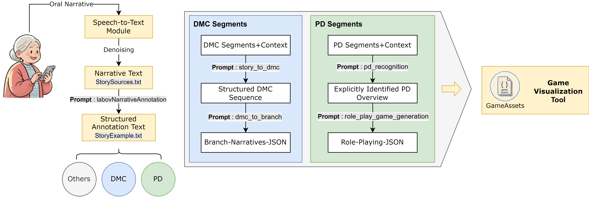

# Game Content Generation Pipeline for Intergenerational Stories (Work in Progress...)



This project is the official code implementation of the paper "GenerPlay: Bridging Asynchronous Intergenerational Communication Through Generative Interactive Narratives". This pipeline can automatically convert structured story texts based on **Labov's narrative framework** into two core mechanisms: **Branching Narrative Mechanism** and **AI Role-Playing Mechanism**.

We provide a story case `StoryExample.txt` to demonstrate the complete end-to-end process.

### Pipeline Overview

The main entry script `story_to_game_pipeline.py` orchestrates the entire process:

```
[StoryExample.txt] -> story_to_game_pipeline.py
                          |
                          +---> interactive_story_game_pipeline.py -> [interactive_story_game.json]
                          |
                          +---> role_playing_game_pipeline.py ------> [role_playing_game.json]
```

### System Architecture and Prompts

The system architecture diagram above illustrates the complete pipeline workflow. All core prompts (shown with **gray backgrounds** in the diagram) are defined in `system_prompt.py` and are crucial for implementing the transformation from narrative to game logic.

#### Pipeline Workflow

The pipeline processes oral narratives through the following stages:

1. **Narrative Preprocessing**:
   - **`labovNarrativeAnnotation`**: Segments and annotates the narrative text according to Labov's six-component framework (L1-L6), producing structured annotation text.

2. **DMC (Decision-Making and Causality) Branch**:
   - **`story_to_dmc`**: Analyzes DMC segments with context to extract structured decision-causality sequences from the protagonist's story.
   - **`dmc_to_branch`**: Transforms the structured DMC sequence into interactive branching narratives with counterfactual choices, generating the final **Branch-Narratives-JSON** output.

3. **PD (Perspective Discussion) Branch**:
   - **`pd_recognition`**: Identifies and extracts explicit perspective discussions from PD segments with context.
   - **`role_play_game_generation`**: Creates AI character configurations with opposing viewpoints based on the identified perspectives, generating the final **Role-Playing-JSON** output.

4. **Asset Generation**:
   - **`defineNarrativeStandards`** & **`drawIllustration`**: Generate stylistically consistent scene illustrations for branching narratives.
   - **`role_play_external_message`**: Generate character portraits and visual assets for role-playing scenarios.

All outputs are packaged with game assets for use in the **Game Visualization Tool**.

### **Visualization Tool**

We provide a Unity-based viewer for loading and displaying the generated mechanism content files, facilitating validation of generation results within a graphical environment.

- **Download**: You can download the tool from: `https://drive.google.com/file/d/1aKqrJh5PgpCA7mAai_IoDBus4Kk2sI8N/view?usp=sharing`
- **Usage**: Simply extract the archive, launch `game-visualization-tool.exe`, and enter the path to your mechanism files (the `output/` directory).
- **Note**: For ready-made mechanism files for testing, please contact the author.

### **Usage**

1.  **Install Dependencies**: 
    Install the required Python packages:
    ```bash
    pip install -r requirements.txt
    ```

2.  **Execute Pipeline**:
    Run the main pipeline:
    ```bash
    python story_to_game_pipeline.py
    ```
    The script will read `StoryExample.txt`, process it, and generate corresponding mechanism directories with JSON files and assets in the `output/` directory, which can be directly loaded into compatible interactive narrative software.

### **Environment Configuration**

Before running the pipeline, you need to configure the LLM API credentials via environment variables:

```bash
# Required: Your OpenAI-compatible API key
export OPENAI_API_KEY=your-api-key-here

# Optional: Custom API endpoint (for non-OpenAI providers)
export OPENAI_API_BASE=https://your-api-endpoint.com/v1

# Optional: Model name (default: gpt-4)
export OPENAI_MODEL=gpt-4
```

